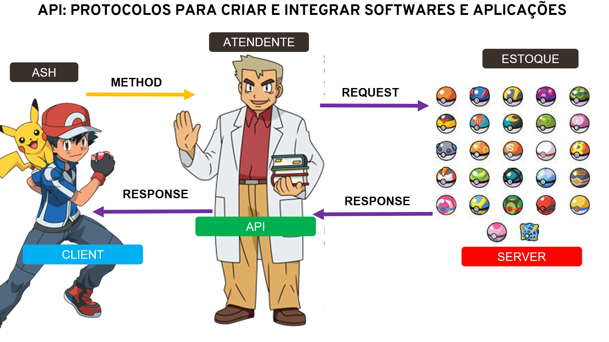
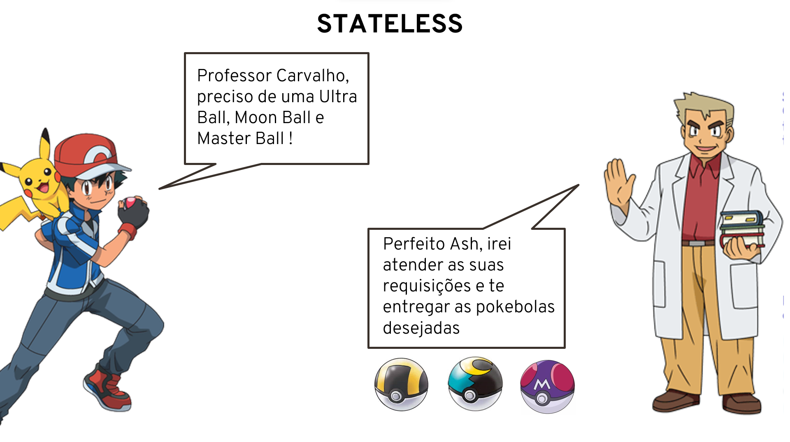

### O que é um API? 

* Um API é um intermediário entre um sistema e outro sistema

## Mestre Pokemon

Você tem o sonho de ser um mestre pokémon e para isso precisa enfrentar alguns líderes de ginásio, um desses líderes é bem forte e será necessário que você capture pokemons bons para conseguir ganhar desse líder, para que você consiga capturar bons pokemons você precisa comprar pokebolas especializadas.

E então você vai até a loja pokemon para comprar algumas pokeboas especializadas,
chegando lá você como cliente diz: "Hey professor Carvalho, pode ver umas pokebolas especificas para que eu capture alguns pokemons?" nesse momento você está solicitando um método. Em seguida, o professor Carvalho verifica se essas pokebolas estão no estoque (servidor) e faz uma requisição, se as pokebolas que o você precisa estão no estoque ele as pega e entrega para você (response). Então uma API é um conjunto de rotinas e padrões que uma aplicação disponibiliza para nós.

### API REST e RESTFUL

Quando você chega na loja para comprar suas pokebolas você espera que seja bem atendido, que a loja esteja organizada e limpa, que te atendam bem e que te deem aquilo que você pediu.Desse mesmo modo você não pode chegar na loja, gritando, xingando e nem tratando mal os funcionários. Ou seja, estamos falando sobre boas práticas, então o REST é o que vai determinar algumas obrigações para essa transferência de dados de uma API.

### Como é feita essa transferência de dados?

Essa transferência é feita através do protocolo HTTP, sendo assim, o REST diz que precisamos seguir algumas regras para essa transferência de dados. Quem precisa seguir essas regras? São as regras que o RESTFUL precisa cumprir, ou seja, ser RESTFUL é cumprir os padrões REST.

### 5 regras para ser RESTFUL

* Client x Server: o cliente e servidor precisam estar separados, desse modo, poderemos ter uma portabilidade do nosso sistema, usando React JS para WEB e React Native para mobile, por exemplo;

* Stateless: cada pokebola que eu pedir para o atendente ele tem que saber exatamente o que eu estou pedindo, ou seja, cada vez que eu chamar uma API esse pedido precisa vir completo, com todas as informações, tudo do jeito certo, ele precisa entender e RESPONDER(response) a REQUISIÇÃO(request);

* Cacheable: as respostas para cada requisição que você fizer deverão ser explicitas, informando se elas podem ser cacheadas ou não;

* Layered System: o cliente acessa o endpoint sem  precisar saber da complexidade, de quais passos estão sendo necessários para o servidor responder a requisição, ou quais outras camadas o servidor está lidando. No exemplo da loja é como se eu quisesse apenas as pokebolas, não me interessa saber se será necessário comprar de um fornecedor , ou seja, eu estou pedindo as pokebolas e quero receber, apenas isso;

* Code on Demand(opcional): o servidor envia para o cliente algum script para ser rodado no front-end (o backend manda para o servidor rodar um script front-end).

